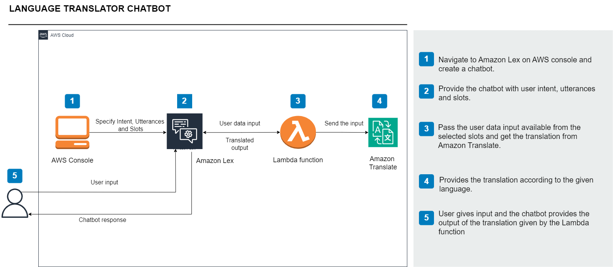
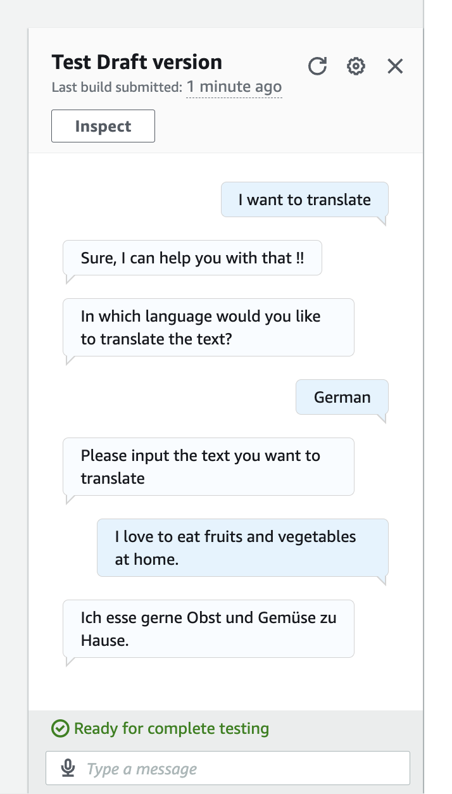

# Project: Multilingual Chatbot with AWS Cloud Services ☁️

## Project Overview
Developed a scalable, serverless language translation chatbot leveraging AWS services. The chatbot allows users to input text in one language and receive accurate translations in real time, demonstrating expertise in cloud architecture, serverless computing, and API integration. The solution simulates a production-ready environment with secure, maintainable, and extensible design.

---

## Key Responsibilities & Technical Implementation
- Built a **scalable chatbot** using Amazon Lex to handle multi-language inputs.  
- Developed **AWS Lambda functions** integrated with Amazon Translate for real-time translation.  
- Secured services with **IAM roles and policies** following best practices.  
- Tested chatbot and functions end-to-end for **accuracy and reliability**.  
- Designed **modular, maintainable architecture** for production-ready deployment.  

---

## Technologies & Services Used
- **Amazon Lex:** Build the chatbot and define conversation flow.  
- **AWS Lambda:** Serverless execution of backend logic and third-party API integration.  
- **Amazon Translate:** High-quality, real-time language translation.  
- **AWS IAM:** Secure role and permission management for cloud resources.  

---

## Impact & Skills Demonstrated
- Delivered a fully functional, end-to-end **serverless chatbot solution**.  
- Applied **Cloud DevOps principles**, including modular architecture, secure IAM roles, and automated testing.  
- Showcased ability to integrate multiple **AWS services** into a cohesive production-ready system.

---

## Architectural Diagram
This it the architectural diagram for the project:

---

## Final Result
This is what your project will look like, once built:

