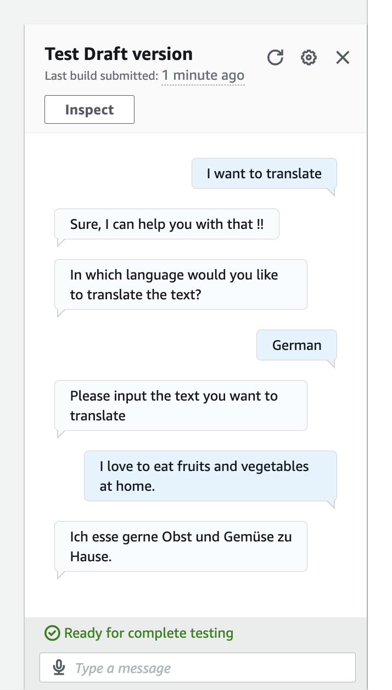

# TextTranslate Chatbot using AWS Lex, Lambda, and Amazon Translate

## Step 1: Bot Creation
I began by building the foundation of the chatbot using **Amazon Lex** with a blank bot. I configured a descriptive name, `TextTranslate`, and provided a clear description of its purpose. I set up an IAM role with basic Lex permissions, selected **English (US)** as the default language, and chose voice settings for interactions. The default intent classification confidence threshold was maintained to ensure the bot accurately interprets user input.

## Step 2: Intent and Slot Configuration
Next, I defined the `TranslateIntent` and its associated slots to enable meaningful user interactions. I added sample **utterances** to help the bot understand user queries and created **slots** to capture key information: the text to be translated and the target language. A custom slot type was used for supported languages, while `AMAZON.FreeFormInput` was used for text input, allowing the bot to dynamically extract user-provided information.


## Step 3: Fulfillment with Lambda Integration
I integrated a **Lambda function** to handle the intent’s execution and fulfill user requests. The bot was configured with prompts to provide feedback on successful or failed actions, ensuring a smooth user experience, and a closing message to gracefully end the interaction.


## Step 4: IAM Role and Permissions
An **IAM role** was created to enable the Lambda function with the necessary permissions. The role was trusted by AWS Lambda and attached the policies `TranslateFullAccess` and `AWSLambdaBasicExecutionRole`, allowing secure execution and access to Amazon Translate.


## Step 5: Lambda Function Implementation
- **Lambda_function.py**: Handles input from Lex, validates the text and language slots, calls Amazon Translate, and returns the translated result to the bot.  
- **languages.py**: Contains a comprehensive list of languages mapped to their ISO codes for translation.  

I tested the Lambda function independently to ensure it returned valid JSON responses compatible with Amazon Lex. This verification confirmed that translated messages could be properly displayed to users.


``` ##OUTPUT##
Status: Succeeded
Test Event Name: translation_test

Response:
{
  "sessionState": {
    "dialogAction": {
      "type": "Close"
    },
    "intent": {
      "name": "TranslateIntent",
      "state": "Fulfilled"
    }
  },
  "messages": [
    {
      "contentType": "PlainText",
      "content": "Ich liebe meinen Hund"
    }
  ]
}

Function Logs:
START RequestId: ed944d2e-3622-44be-bc18-091ecb778efd Version: $LATEST
EVENT: {"sessionState": {"intent": {"name": "TranslateIntent", "slots": {"text": {"value": {"interpretedValue": "I love my dog", "originalValue": "I love my dog"}}, "language": {"value": {"interpretedValue": "German", "originalValue": "German"}}}}}}
END RequestId: ed944d2e-3622-44be-bc18-091ecb778efd
REPORT RequestId: ed944d2e-3622-44be-bc18-091ecb778efd	Duration: 2153.48 ms	Billed Duration: 2491 ms	Memory Size: 128 MB	Max Memory Used: 84 MB	Init Duration: 337.39 ms

Request ID: ed944d2e-3622-44be-bc18-091ecb778efd
```

## Step 6: Chatbot Testing
To test the chatbot, I navigated to the **Intent page** and linked the Lambda function sgit o Lex could invoke it during interactions. After connecting the Lambda function, the chatbot was ready for end-to-end testing. I validated its performance using sample conversations, confirming that it accurately handled user input, translated text in real-time, and responded gracefully to errors or missing information.



## Conclusion
This project demonstrates my ability to design and implement a fully functional, intelligent chatbot using **AWS Lex, Lambda, and Amazon Translate**. I built a robust, user-friendly system that handles natural language input, validates data, manages errors gracefully, and provides real-time translations. It showcases my skills in **cloud architecture, serverless development, and practical problem-solving**, highlighting my ability to deliver scalable, production-ready solutions that meet user needs effectively.
